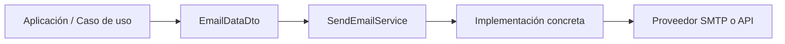

# Documentación técnica · BBPHP Email Sender Core

## 1. Objetivo

Este repositorio define el núcleo de abstracción para el envío de correos electrónicos en aplicaciones PHP. Su objetivo es proporcionar un contrato común para la construcción y envío de mensajes, sin depender de una implementación concreta de proveedor.

En otras palabras, el paquete no pretende enviar emails por sí mismo, sino ofrecer una capa base sobre la que construir adapters o implementaciones específicas para SMTP, API REST, proveedores comerciales o servicios internos.

## 2. Contexto del proyecto

- Nombre del paquete: `xsga/bbphp-emailsender-core`
- Tipo: librería PHP reusable
- PHP mínimo: 8.4
- Espacio de nombres base: `Xsga\BBPHP\EmailSender\Core\`
- Dependencia principal: `xsga/bbphp-exception`

## 3. Alcance

El paquete cubre la parte de dominio y aplicación de la funcionalidad de email:

- enum de método de envío;
- interfaz del servicio de email;
- DTO para el contenido del mensaje;
- excepción de dominio para errores de envío.

La capa de infraestructura concreta (por ejemplo SMTP, Resend, Mailgun, SES, etc.) queda fuera de este repositorio y debe implementarse en un adaptador del proyecto consumidor.

## 4. Arquitectura

El diseño del paquete se apoya en una separación clara entre dominio y aplicación:

### 4.1 Capa Domain

Responsable de los conceptos centrales del dominio de envío de email.

- `EmailMethods`: enum que representa los métodos de envío soportados.
- `SendEmailException`: excepción específica del dominio para fallos de envío.

### 4.2 Capa Application

Responsable de los contratos y transfer objects usados por la aplicación.

- `SendEmailService`: interfaz con el método `send()`.
- `EmailDataDto`: contenedor con los datos del correo a enviar.

### 4.3 Patrón aplicado

El proyecto usa una variante del patrón Strategy:

- la lógica de negocio consumirá una abstracción: `SendEmailService`;
- cada implementación concreta decidirá el mecanismo real de envío;
- el consumidor solo necesita conocer la interfaz y la estructura del `EmailDataDto`.

Esto permite cambiar de proveedor sin introducir acoplamientos en la lógica de negocio.

## 5. Estructura del repositorio

```text
Src/
└── Xsga/
    └── BBPHP-EmailSender-Core/
        ├── Application/
        │   ├── Dto/
        │   │   └── EmailDataDto.php
        │   └── Services/
        │       └── SendEmailService.php
        └── Domain/
            ├── EmailMethods.php
            └── Exceptions/
                └── SendEmailException.php
```

## 6. Componentes principales

### 6.1 `EmailMethods`

Archivo: `Src/Xsga/BBPHP-EmailSender-Core/Domain/EmailMethods.php`

```php
namespace Xsga\BBPHP\EmailSender\Core\Domain;

enum EmailMethods: string
{
    case SMTP = 'smtp';
    case RESEND = 'resend';
}
```

#### Propósito

Representa el canal o método de envío disponible. En su estado actual solo define dos valores:

- `SMTP`
- `RESEND`

Este enum sirve para que el proyecto consumidor elija o valide el proveedor de entrega en tiempo de configuración o de inyección de dependencias.

### 6.2 `SendEmailService`

Archivo: `Src/Xsga/BBPHP-EmailSender-Core/Application/Services/SendEmailService.php`

```php
namespace Xsga\BBPHP\EmailSender\Core\Application\Services;

use Xsga\BBPHP\EmailSender\Core\Application\Dto\EmailDataDto;

interface SendEmailService
{
    public function send(EmailDataDto $emailData): void;
}
```

#### Propósito

Establece el contrato mínimo para todos los adapters de envío. Toda implementación debe aceptar un `EmailDataDto` y no devolver datos de respuesta, sino lanzar una excepción si el envío falla.

### 6.3 `EmailDataDto`

Archivo: `Src/Xsga/BBPHP-EmailSender-Core/Application/Dto/EmailDataDto.php`

```php
final class EmailDataDto
{
    public string $sender = '';
    public string $senderName = '';
    public array $recipients = [];
    public array $recipientsCC = [];
    public array $recipientsBCC = [];
    public string $subject = '';
    public string $body = '';
    public array $attachments = [];
}
```

#### Propósito

Agrupa todos los datos necesarios para compilar un correo. Su diseño permite:

- definir remitente y nombre visible;
- definir destinatarios principales y copias;
- incluir asunto y cuerpo HTML;
- preparar una lista de adjuntos para futuras implementaciones.

### 6.4 `SendEmailException`

Archivo: `Src/Xsga/BBPHP-EmailSender-Core/Domain/Exceptions/SendEmailException.php`

```php
final class SendEmailException extends GenericException
```

#### Propósito

Centraliza la excepción para errores de envío. Al heredar de `GenericException`, mantiene la compatibilidad con la librería base de excepciones del proyecto.

## 7. Flujo de uso

El proceso típico del paquete es:

1. el consumidor crea un `EmailDataDto`;
2. el consumidor selecciona o configura el `SendEmailService` adecuado;
3. se invoca `send($emailData)`;
4. si el proveedor falla, se lanza `SendEmailException`.



## 8. Ejemplo de integración

```php
<?php

use Xsga\BBPHP\EmailSender\Core\Application\Dto\EmailDataDto;
use Xsga\BBPHP\EmailSender\Core\Application\Services\SendEmailService;

/** @var SendEmailService $emailService */

$emailData = new EmailDataDto();
$emailData->sender = 'noreply@midominio.com';
$emailData->senderName = 'Mi aplicación';
$emailData->recipients = ['usuario@ejemplo.com'];
$emailData->recipientsCC = ['soporte@ejemplo.com'];
$emailData->subject = 'Confirmación de registro';
$emailData->body = '<h1>Hola</h1><p>Tu cuenta ha sido creada correctamente.</p>';

$emailService->send($emailData);
```

## 9. Consideraciones de diseño

### 9.1 Separación de responsabilidades

El paquete no mezcla:

- reglas del negocio de la aplicación;
- lógica de personalización del mensaje;
- configuración del proveedor externo;
- infraestructura real de entrega.

Esto ayuda a mantener un código más mantenible y extensible.

### 9.2 Flexibilidad de proveedor

El enum `EmailMethods` facilita la decisión de qué implementación usar. Un contenedor de dependencias, una factoría o una configuración por entorno puede resolver el servicio apropiado según el método deseado.

### 9.3 Extensibilidad

El repositorio está preparado para crecer con nuevas implementaciones, por ejemplo:

- `SmtpEmailService`
- `ResendEmailService`
- `SesEmailService`
- `MailgunEmailService`

Cada una de esas clases solo tendría que implementar `SendEmailService` y aceptar el mismo DTO.

## 10. Limitaciones actuales

El paquete actual es un núcleo mínimo y presenta varias limitaciones intencionales:

- no tiene una implementación concreta de envío;
- no valida datos de correo ni formato de destinatarios;
- no gestiona colas ni reintentos;
- no incluye plantillas ni renderizado de contenido;
- no dispone de un adaptador para SMTP o Resend en este repositorio.

Estas decisiones son coherentes con su naturaleza de librería de contrato y dominio, no de infraestructura terminada.

## 11. Recomendaciones de uso

- mantener el contenido del correo ya preparado antes de invocar `send()`;
- validar remitentes y destinatarios en la capa de aplicación o de infraestructura;
- manejar `SendEmailException` en el punto de integración;
- usar un mismo DTO para todos los proveedores para evitar cambios en caso de migración;
- centralizar la configuración del proveedor en la capa de infraestructura del proyecto consumidor.

## 12. Seguridad

Aunque este paquete no realiza conexiones de red ni envía mensajes directamente, conviene considerar:

- no registrar contenido sensible del email en logs;
- no almacenar credenciales de proveedor en código fuente;
- sanitizar HTML si se va a incluir contenido dinámico;
- validar el origen de los destinatarios y remitentes antes del envío.

## 13. Conclusión

`BBPHP-EmailSender-Core` es un paquete de base técnica para la capa de email de la aplicación. Su valor principal está en definir un contrato estable para la entrega de correos y dejar la implementación real a adapters específicos.

Gracias a este enfoque, la aplicación puede evolucionar entre proveedores de email sin afectar la lógica de negocio que genera el mensaje.
